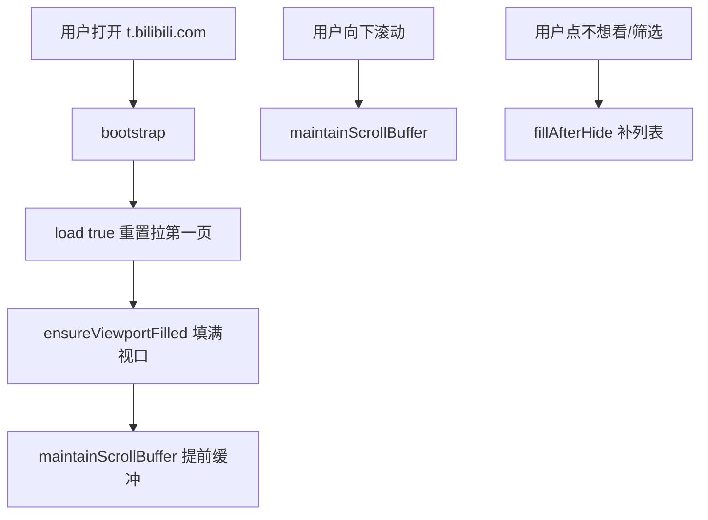
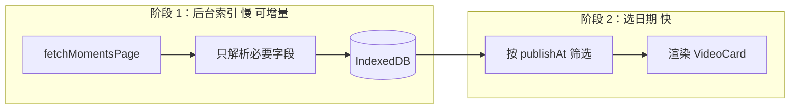

# API 与 BiliDynamicBox 动态收件箱：从入门到本项目

> 面向 BiliDynamicBox（B 站动态收件箱扩展）读者的长文说明。  
> 解释：API 是什么、本项目如何用 B 站 API 拉动态、滚动加载怎么工作、AI API 有何不同、以及「按日期筛选」为什么难做。  
> 代码路径以仓库 `extension/` 为准，版本约 **1.0.0**。

---

## 目录

1. [API 到底是什么](#1-api-到底是什么)
2. [浏览器扩展里怎么调用 API](#2-浏览器扩展里怎么调用-api)
3. [本项目使用的 B 站动态 API](#3-本项目使用的-b-站动态-api)
4. [从原始 JSON 到视频卡片](#4-从原始-json-到视频卡片)
5. [分页、预加载与滚动加载](#5-分页预加载与滚动加载)
6. [AI 的 API 和 B 站 API 有什么区别](#6-ai-的-api-和-b-站-api-有什么区别)
7. [日期筛选为什么慢](#7-日期筛选为什么慢)
8. [「轻量获取标题」能不能加速](#8-轻量获取标题能不能加速)
9. [若未来重做日期筛选：可行架构](#9-若未来重做日期筛选可行架构)
10. [附录：术语表与文件索引](#10-附录术语表与文件索引)

---

## 1. API 到底是什么

### 1.1 一句话

**API（Application Programming Interface，应用程序编程接口）** 在这里可以通俗理解为：

> 远程服务器规定好的一套「网址 + 参数 → 返回数据」的约定。  
> 你的程序按约定发请求，服务器按约定回 JSON，你再把 JSON 变成界面上的内容。

不是魔法，也不是直接读 B 站数据库，而是 **HTTP 网络请求**。

### 1.2 和「打开网页」的关系

你在浏览器打开 `https://t.bilibili.com/` 时：

- 页面 HTML/CSS/JS 负责 **界面**
- 页面里的 JavaScript 会在后台 **调用 B 站 API** 拿动态列表
- 再把数据渲染成你看到的卡片

BiliDynamicBox 扩展做的事是：

- **跳过** B 站原版的动态列表 UI
- **直接调用** 同一个（或同类）后端 API
- 用 Vue 自己画「动态收件箱」

所以扩展和网页的关系是：**共用后端数据，不同的前端呈现**。

### 1.3 一次 API 调用的四要素

| 要素 | 含义 | B 站动态列表示例 |
|------|------|------------------|
| **URL** | 找哪个服务、哪个路径 | `https://api.bilibili.com/x/polymer/web-dynamic/v1/feed/all` |
| **方法** | GET / POST 等 | GET（只读取） |
| **参数** | 告诉服务器要什么 | `type=video`、`offset=xxx` |
| **鉴权** | 证明你是谁 | 浏览器 Cookie（登录 B 站后的会话） |

返回通常是 **JSON**：一种带 `{}`、 `[]` 键值结构的文本，程序容易解析。

### 1.4 和 TypeScript 的关系

项目里 API 相关代码写在 `*.ts` 文件里，例如 `bilibili-api.ts`。

- **TypeScript** = 带类型检查的 JavaScript 写法
- 构建工具（Vite）会把它 **编译成 `.js`**
- 扩展最终在 Chrome 里跑的是 `dist/content/content.js`

你看到的：

```typescript
export async function fetchMomentsPage(offset = ""): Promise<MomentsPageResult>
```

含义是：一个 **异步函数**，调用 B 站接口拉一页动态，返回类型是 `MomentsPageResult`（TypeScript 用来帮你少写错字段名）。

---

## 2. 浏览器扩展里怎么调用 API

### 2.1 Content Script 的位置

本扩展是 **Manifest V3** 插件，在 `https://t.bilibili.com/*` 注入脚本（见 `extension/manifest.json`）。

注入后：

- 代码跑在 **页面上下文** 里（和 B 站同域）
- 可以用 `fetch()` 发请求
- 带上 `credentials: "include"` 时，会自动带上 **你已登录 B 站的 Cookie**

因此 API 知道「当前是哪个用户」，返回的是 **你的关注动态**，不是随便哪个人的。

### 2.2 fetch 在代码里长什么样

```typescript
const response = await fetch(url.toString(), {
  credentials: "include",
})

const payload = await response.json()
```

流程：

1. 发 HTTP 请求
2. 等响应
3. 把 body 解析成 JavaScript 对象（JSON）

若 `payload.code !== 0`，说明 B 站业务层报错（未登录、风控、参数错误等）。

### 2.3 扩展还调了哪些 API

除 **拉动态列表** 外，`bilibili-api.ts` 还有：

| 函数 | 用途 | 方法 |
|------|------|------|
| `fetchMomentsPage` | 拉关注视频动态流 | GET |
| `saveToWatchLater` | 加入稍后再看 | POST |
| `unfollowUp` | 取关 UP 主 | POST |

后两者需要 CSRF（Cookie 里的 `bili_jct`），属于 **写操作**；拉动态是 **读操作**。

---

## 3. 本项目使用的 B 站动态 API

### 3.1 接口地址

```text
GET https://api.bilibili.com/x/polymer/web-dynamic/v1/feed/all?type=video
GET https://api.bilibili.com/x/polymer/web-dynamic/v1/feed/all?type=video&offset=<游标>
```

对应代码：

```19:24:extension/src/services/bilibili-api.ts
export async function fetchMomentsPage(offset = ""): Promise<MomentsPageResult> {
  const url = new URL("https://api.bilibili.com/x/polymer/web-dynamic/v1/feed/all")
  url.searchParams.set("type", "video")
  if (offset) {
    url.searchParams.set("offset", offset)
```

### 3.2 参数说明

| 参数 | 必填 | 含义 |
|------|------|------|
| `type=video` | 是 | 只要 **视频类** 动态（AV/稿件），过滤图文、直播等 |
| `offset` | 否 | **分页游标**。第一页不传；下一页传上一页响应里的 `offset` |

**没有** 以下参数（至少在这个接口上）：

- `date=2024-04-12`（按日期查）
- `fields=title`（只要标题）
- `page=50`（跳到第 50 页）

这就是为什么「查一年前的某一天」只能 **从新到旧一页页翻**。

### 3.3 响应结构（简化）

```typescript
interface MomentsApiResponse {
  code?: number
  data?: {
    items?: DynamicItem[]   // 这一页的动态列表
    offset?: string         // 下一页游标
    has_more?: boolean      // 是否还有下一页
  }
}
```

封装后：

```typescript
interface MomentsPageResult {
  items: DynamicItem[]
  nextOffset: string
  hasMore: boolean
}
```

一页通常十几～二十条 `items`（具体由 B 站决定，不保证固定条数）。

### 3.4 这是「官方开放 API」吗？

**不完全是。**

- 域名 `api.bilibili.com` 是 B 站正规后端
- 但该路径是给 **B 站网页/App 内部用** 的，没有像「开放平台文档」那样对第三方保证稳定
- 扩展属于 **逆向使用 + 个人工具** 常见做法
- 接口字段、风控、分页策略 **可能随时变化**，代码需要容错（本项目在 `filter-video.ts` 里对脏数据有 try/catch 跳过）

### 3.5 限制与风险（实务）

| 类型 | 说明 |
|------|------|
| **登录** | 未登录或 Cookie 失效 → 拉不到关注流 |
| **频控** | 短时间请求过多 → 变慢、报错、412/429 等（无公开阈值） |
| **顺序** | 只能按 `offset` 顺序翻，不能跳转到「第 N 天」 |
| **数据范围** | 是「关注动态流」，不是全站搜索、不是观看历史 |
| **合规** | 上架 Chrome 商店时需隐私说明；勿滥用高频爬取 |

---

## 4. 从原始 JSON 到视频卡片

### 4.1 两层数据结构

```
B 站 API 返回 DynamicItem（原始一条动态）
        ↓ filterVideoDynamics / mapToCard
本地使用 VideoDynamicCard（视频卡片，UI 最小单位）
```

**DynamicItem**（`domain/types.ts`）：和 B 站 JSON 字段对齐，嵌套很深，例如：

```text
item.modules.module_dynamic.major.archive.title
item.modules.module_author.pub_ts
```

**VideoDynamicCard**：扁平、固定字段，供 Vue 组件直接用：

| 字段 | 用途 |
|------|------|
| `dynamicId` | 动态唯一 ID，隐藏/垃圾箱/去重 |
| `videoAid` / `videoBvid` | 视频标识，跳转、稍后再看 |
| `title` / `cover` | 展示 |
| `durationSeconds` | 时长筛选 |
| `upMid` / `upName` | UP 主信息、搜索、取关 |
| `publishAt` | 发布时间（Unix 秒），**日期分组** |

### 4.2 过滤：只要视频动态

`filter-video.ts` 里：

- 判断 `type === DYNAMIC_TYPE_AV` 或 `major.type === MAJOR_TYPE_ARCHIVE`
- 非视频动态 **整行丢弃**
- 映射成 `VideoDynamicCard`

因此：**API 一页里可能混有多种动态类型，最终进收件箱的只有视频。**

### 4.3 为什么「卡片」是最小单位

当前 `inbox` store（`store/inbox.ts`）里：

- `allCards: VideoDynamicCard[]` 存所有已加载卡片
- `load()` 每拉一页 → `filterVideoDynamics` → 追加到 `allCards` → `rebuildGroups()` 按日期分组
- UI 的 `InboxGroup` / `VideoCard` 直接绑 `VideoDynamicCard`

**刷新、滚动加载、隐藏、垃圾箱** 都围绕「卡片」状态转。

这不是 API 的要求，是 **本项目的状态设计**；理论上可以只存更少的字段（见第 8 章）。

---

## 5. 分页、预加载与滚动加载

### 5.1 三种加载场景



| 函数 | 何时调用 | 目的 |
|------|----------|------|
| `load(true)` | 首次进入 | 清空状态，拉 **第一页** |
| `load(false)` | 翻页 | 用 `nextOffset` 拉 **下一页** |
| `ensureViewportFilled` | 首屏、隐藏后 | 若屏幕填不满，连续拉多页（最多约 20 页） |
| `maintainScrollBuffer` | 滚动接近底部 | **提前**再拉几页，保持底部有缓冲 |
| `fillAfterHide` | 不想看/筛选后 | 视口变空时补货 + 缓冲 |

### 5.2 「提前加载」怎么判断

`utils/layout.ts`：

```typescript
// 距离底部的像素
scrollHeight - scrollTop - clientHeight

// 若小于 2 个视口高度 → 需要继续 prefetch
getScrollBufferPx(scrollRoot, 2)
```

含义：**还没滚到底，只要离底部不够远，就开始拉下一页**——这就是你说的「比当前页面提前加载一些」。

### 5.3 「滚动加载」怎么触发

`App.vue` 在 `#bewly-inbox-root` 上监听 `scroll`：

```typescript
root.addEventListener("scroll", onScrollHandler, { passive: true })
// → requestAnimationFrame 节流
// → inbox.maintainScrollBuffer(root)
```

用户 **往下滚** → 接近底部 → 自动 `load(false)` 静默拉页。

### 5.4 静默加载 vs 显示「加载更多」

- `load(false, { silent: true })`：不置 `loadingMore`，后台 prefetch
- `load(false)` 非 silent：UI 可显示「正在加载更多...」

首屏预取还有 `inbox-preload.ts`：在 Content Script 启动时 **提前打第一页 API**，减少白屏（`takeInboxFirstPagePreload` 灌进首次 `load(true)`）。

### 5.5 分组计数扫描（另一条后台链）

`runFinalCountScan` 会在首屏之后 **继续翻页**，但只为了更新 `finalGroupCounts`（每个日期分组的总条数），**不一定**把所有卡片都放进首屏列表。

注意：它 **仍然调用同样的 `fetchMomentsPage`**，网络次数一样，只是内存用途不同。

---

## 6. AI 的 API 和 B 站 API 有什么区别

两者都叫 API，但 **服务类型完全不同**。

### 6.1 对比总表

| 维度 | B 站动态 API（本项目） | AI API（OpenAI / Claude / 国内大模型等） |
|------|------------------------|------------------------------------------|
| **目的** | 读取 **已有** 业务数据 | **生成/理解** 文本（对话、摘要、分类） |
| **典型方法** | GET | POST |
| **核心输入** | `offset`、`type` | `messages` / `prompt`、`model` |
| **核心输出** | 动态列表 JSON | 模型生成的一段文字（或 embedding 向量） |
| **分页** | offset 顺序翻页 | 一般无「动态流翻页」；长对话靠 token 窗口 |
| **鉴权** | 用户 Cookie | API Key / OAuth |
| **费用** | 对用户无单独 API 账单 | 按 token 计费 |
| **确定性** | 同一条动态数据应稳定 | 同 prompt 可能略有差异 |
| **能否替代拉动态** | — | **不能**（模型没有你的 B 站关注库） |

### 6.2 请求形态对比

**B 站（读列表）：**

```http
GET /x/polymer/web-dynamic/v1/feed/all?type=video&offset=xxx
Cookie: SESSDATA=...
```

**AI（对话）：**

```http
POST /v1/chat/completions
Authorization: Bearer sk-...
Content-Type: application/json

{
  "model": "gpt-4o",
  "messages": [
    { "role": "user", "content": "请把这些标题按主题分类：..." }
  ]
}
```

### 6.3 在 BiliDynamicBox 里 AI 适合做什么

适合 **第二层能力**（需另接 API Key，当前版本未内置）：

- 对 **已拉取** 的标题做摘要、打标签
- 根据浏览习惯推荐「先看哪条」
- 自然语言搜索（「找上周某个 UP 发的编程视频」）——但仍需先有本地索引或先拉数据

不适合：

- 代替 `fetchMomentsPage` 去「问 AI 我一年前关注了哪些视频」

数据流应是：

```text
B 站 API（取数） → 本地 store / 索引（存） → 可选 AI API（理解/生成）
```

---

## 7. 日期筛选为什么慢

### 7.1 产品需求 vs 接口能力

若产品要做：**「只看 2024 年 4 月 12 日发布的关注视频」**

接口实际能力：**「从最新一条开始，一页页往旧翻」**

中间可能隔着：

- 几个月 × 每天数十条视频动态 × 每页 ~20 条  
→ 可能需要 **几十到上百次 HTTP 请求** 才能「扫过」目标那一天

在扫完之前，目标日期的卡片 **还没出现在 `allCards` 里**，界面只能显示加载中或空。

### 7.2 时间线示意

```text
现在 ──► 2026-06 的动态（第 1～N 页）
              │
              ▼ 继续 offset
         2025-12 … 2025-06 …
              │
              ▼
         2024-04-12  ◄── 目标日在这附近
              │
              ▼
         更更早 …
```

API **不能** 从右侧直接跳到 2024-04-12，只能从左往右走完。

### 7.3 和「滚动加载」的冲突

正常浏览时：

- 用户滚多少，加载多少，**提前缓冲 2 屏** 即可

日期筛选时（若实现）：

- 必须 **持续往后翻** 直到 `publishAt` 早于目标日 00:00
- 即使用户不滚动，也要后台狂拉页
- 若目标日最终 **0 条视频**，也要扫过那一整段才知道「没有」

这就是为什么你之前体验到「加载 2023 年 4 月 12 日」要很久。

### 7.4 本项目曾有的实现（后已移除）

曾实现过：

- 日历 UI 选日期
- `loadForDate` 循环 `fetchMomentsPage` 直到 `hasLoadedThroughDate`
- 进度文案：「已加载 N 页 · 已回溯到 X 月 X 日」

因 **体验慢、易卡死、与滚动加载互相干扰**，已在后续版本 **删除日期筛选**，保留按「今天 / 昨天 / 日期」**分组展示**（不对历史做强制筛选）。

---

## 8. 「轻量获取标题」能不能加速

### 8.1 想法

> 前面的视频只存 title / dynamicId / publishAt，不建完整 VideoDynamicCard，  
> 是不是翻页会快很多？

### 8.2 结论

**几乎不能减少「慢」的主因。**

| 能省的 | 不能省的 |
|--------|----------|
| 内存占用 | HTTP 请求 **次数** |
| Vue 渲染 / DOM 节点 | 单次响应 **体积**（B 站仍返回完整 JSON） |
| localStorage 体积 | 等 B 站响应的 ** wall time** |

瓶颈在 **网络 + 顺序翻页**，不在你本地 `VideoDynamicCard` 字段多几个。

### 8.3 API 有没有「轻量模式」

**没有。**  
`feed/all` 返回的每条 `DynamicItem` 结构由 B 站定义；你不能在 URL 上加 `?lite=1` 只拿标题。

你只能在 **收到完整 JSON 之后**，本地选择 **少存几个字段**——这对「翻到一年前」帮助很小。

### 8.4 轻量存储仍有价值的地方

若未来做 **本地索引**（见下一章）：

- 扫描阶段存 `{ dynamicId, publishAt, title, aid, bvid, upMid }`
- 不渲染封面、不算分组 UI
- 扫完再对 **选中日期** 做完整展示

省的是 **扫描过程中的 CPU/内存/卡顿**，不是 **第一次扫描的总时间**（除非配合缓存，第二次就快了）。

---

## 9. 若未来重做日期筛选：可行架构

若产品仍需要「查某历史日期」，推荐 **索引 + 增量**，而不是每次重扫。

### 9.1 两阶段架构



**阶段 1 — 索引同步（慢，可后台跑）**

- 仍用 `fetchMomentsPage`
- 每条存轻量记录 + 必要 id
- 记录 `lastOffset`，下次只增量同步新页
- UI：进度条「已同步至 2024-08-03」

**阶段 2 — 按日查看（快）**

- 从 IndexedDB 查 `publishAt` 落在目标日的条目
- 若索引里已有 title/cover/aid，**无需再请求**
- 缺字段时再按需调视频详情 API（若有）

### 9.2 产品层降级选项

若不做全量索引：

- 仅支持 **最近 7 / 30 天** 或 **最近 50 页** 内的日期筛选
- 选更早日期时明确提示：「需先同步，预计 N 分钟」
- 提供 **暂停/取消** 扫描

### 9.3 与滚动加载共存

- 索引同步和 `maintainScrollBuffer` **互斥锁**（避免 offset 错乱）
- 或索引用 **独立 offset 游标** 存 IndexedDB，与首屏 `inbox` 状态分离

这些是当前 `inbox.ts` **尚未实现** 的方向；本文档仅作设计参考。

---

## 10. 附录：术语表与文件索引

### 10.1 术语表

| 术语 | 解释 |
|------|------|
| **API** | 远程服务的数据/能力调用约定，通常经 HTTP + JSON |
| **fetch** | 浏览器发 HTTP 请求的 API |
| **JSON** | `{ "key": "value" }` 形式的数据交换格式 |
| **TypeScript** | 带类型的 JavaScript，源码 `.ts`，编译为 `.js` |
| **Content Script** | 扩展注入到网页里运行的脚本 |
| **offset** | B 站动态流分页游标，opaque 字符串，必须顺序使用 |
| **DynamicItem** | B 站返回的单条动态原始结构 |
| **VideoDynamicCard** | 本项目定义的视频卡片模型 |
| **Pinia store** | Vue 全局状态（`inbox` / `decision` / `trash`） |
| **prefetch** | 用户还没滚到底时提前拉下一页 |
| **token（AI）** | 大模型计费与长度单位，约等于字数块 |

### 10.2 本项目关键文件

| 文件 | 职责 |
|------|------|
| `extension/src/services/bilibili-api.ts` | B 站 HTTP 封装 |
| `extension/src/domain/filter-video.ts` | 原始动态 → 视频卡片 |
| `extension/src/domain/group-by-date.ts` | 今天/昨天/日期分组 |
| `extension/src/store/inbox.ts` | 加载、分页、滚动缓冲 |
| `extension/src/services/inbox-preload.ts` | 第一页预加载 |
| `extension/src/utils/layout.ts` | 滚动距离与缓冲计算 |
| `extension/src/app/App.vue` | 滚动监听、筛选 UI 逻辑 |
| `extension/manifest.json` | 扩展权限与注入规则 |

### 10.3 相关阅读

- 仓库内 `plan/技术方案.md` — 工程结构与模块划分  
- 仓库内 `需求.md` — 产品行为定义  
- 本文档 — API 概念与数据流、日期筛选难点  

---

## 结语

- **API** 是程序和 B 站服务器之间的「下单规则」；本项目靠它 **读** 关注视频动态，不是靠 AI **生成** 内容。  
- **慢** 的根源是 **接口只能顺序翻页、不能按日期查询**，不是本地卡片对象太大。  
- **滚动 + 提前缓冲** 适合「连续浏览最近动态」；**历史日期筛选** 需要另一套 **索引/缓存** 产品与技术方案。  
- **AI API** 可在「已有数据」之上做摘要、分类等增强，但 **不能替代** B 站动态 API。

若你希望把本文档排成 PDF（与 `docs/kami/long-doc.html` 同风格），可以说一声，可再生成排版版 HTML/PDF。

---

*文档版本：2026-06 · 对应扩展 manifest 1.0.0*
